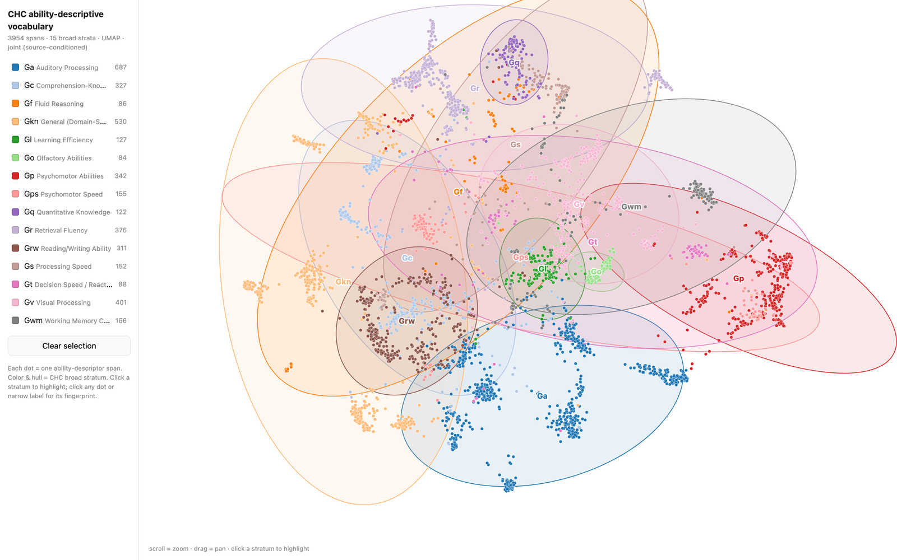
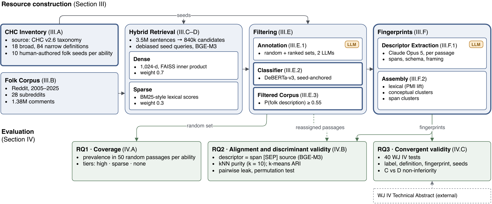

# CHC Folk Vocabulary

[](LICENSE) [](LICENSE-DATA)

A corpus-grounded vocabulary of how people describe cognitive abilities in everyday language, mapped onto the narrow abilities of the Cattell-Horn-Carroll (CHC) model.

## Overview

CHC is the most widely validated taxonomy of human cognitive abilities, but its narrow-ability labels are psychometric constructs, not the language people actually use. This project builds the missing bridge: a labeled corpus of naturalistic sentences (*ability descriptors*) that depict someone exercising a specific CHC narrow ability, and a structured per-ability profile (*ability fingerprint*) aggregated from them. It covers the 71 narrow abilities that Schneider and McGrew's definitions sheet does not mark as tentative.

Explore the clustered descriptors at [chcfolkvocab.yesnlp.us](https://chcfolkvocab.yesnlp.us).

<p align="center">
    <a href="https://chcfolkvocab.yesnlp.us"></a>
</p>

## Pipeline

<p align="center">
    
</p>

1. **Inventory**: the CHC taxonomy (verbatim from Schneider & McGrew) plus this project's discriminator glosses and ten everyday seed sentences per ability.
2. **Corpus and retrieval**: Reddit comments segmented into sentences, indexed with BGE-M3 (dense + sparse), and retrieved per ability by its seed sentences.
3. **Annotation and filtering**: two LLM raters label frozen samples; a seed-conditioned relevance classifier trained on their averaged labels filters each ability's candidate pool.
4. **Extraction and fingerprints**: per-passage descriptor extraction, assembled into per-ability fingerprints.
5. **Structure analyses**: source-conditioned embeddings test whether the taxonomy is recoverable from folk language and which ability pairs it fails to separate.
6. **Validation**: WJ IV test descriptions are matched to abilities by label, definition, fingerprint or seeds.

[`docs/pipeline.md`](docs/pipeline.md) gives the command for every step and maps each script to the paper section, table or figure it produces.

## Quick start

```bash
git clone https://github.com/Jiho-YesNLP/chc-folk-vocabulary.git
cd chc-folk-vocabulary
uv sync --extra viz
cp .env.example .env   # OPENAI_API_KEY (and OPENAI_BASE_URL for an OpenAI-compatible endpoint)
```

Scripts are named by stage (`scripts/p2_*.py` … `scripts/p6_*.py`), and each takes the config with the same prefix from `configs/`:

```bash
uv run python scripts/p2_retrieve_passages.py configs/p2_retrieval.yaml --all
```

**Hardware.** Index building, classifier training and scoring, fingerprint assembly and joint embedding need a CUDA GPU (developed on 24 GB cards with the CUDA 12.4 build of PyTorch, which `uv` installs on Linux). Everything else, including all statistics, figures and the WJ IV validation report, runs on CPU. Downloading the Reddit dumps needs `aria2c` and `zstd`; the compressed comment dumps for the 54 subreddits take about 21 GB and the search index about 40 GB.

## Data and models

The released resources let you skip the expensive stages:

- **Relevance classifier** (the three averaged checkpoints used to filter the corpus) on Hugging Face: lets you skip classifier training in Stage 3. *Link added on release.*
- **Labeled corpus and fingerprint database** on Zenodo, with the WJ IV task descriptions and their citations: lets you start the analyses at Stage 5 without downloading Reddit or running the GPU stages. *DOI added on release.*

The Reddit dumps themselves are not redistributed. `data/raw/reddit.torrent` identifies the exact dump (the Academic Torrents listing it came from is no longer online), and `data/raw/reddit_dump_manifest.json` lists the 54 comment files used, with their torrent indices, byte sizes and comment counts. Everything else needed to rebuild the resources from scratch is in this repository: the inventory and seeds (`data/raw/`), the annotation and extraction instruments (`data/raw/annotation/`, `docs/`), and the configs.

## Repository layout

```
configs/    one YAML per pipeline step, prefixed by stage (see configs/README.md)
scripts/    pipeline entry points, prefixed by stage (p2–p6)
src/        shared library code (inventory loading, schemas, encoders)
data/raw/   committed inputs: CHC taxonomy, project annotations, instruments, WJ IV materials
docs/       pipeline reference, extraction rubric, in-conversation protocols, figures
webapp/     static cluster-explorer site and its data
```

`data/processed/`, `data/interim/`, `results/` and `models/` are created by the pipeline and are not tracked.

## Citation

```bibtex
@unpublished{noh2026everyday,
  title  = {How Everyday Language Describes Cognitive Abilities: A Folk Vocabulary Resource for the {Cattell-Horn-Carroll} Taxonomy},
  author = {Noh, Jiho and Ramani, Shwetaben},
  year   = {2026},
  note   = {Manuscript submitted for publication}
}
```

## License

Code is released under the [MIT License](LICENSE). The project's own data (seed sentences, discriminator glosses, annotations, rubrics, WJ IV task paraphrases, fingerprints) is released under [CC BY 4.0](LICENSE-DATA). The CHC ability names, descriptions and definitions are quoted from Schneider and McGrew's definitions sheet and remain theirs; see [`LICENSE-DATA`](LICENSE-DATA) for the attribution and the files that contain them.
